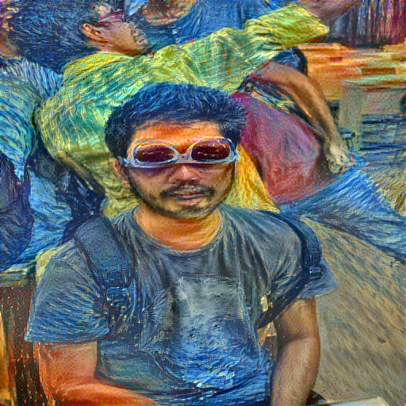

# image-ns

Attempt to work with artistic style transfer for images

```python run.py --content <input-file> --styles <styles-file> --output <output-file>```

```--iterations``` flags to set custom number of iterations, default 1000

Some outputs on 500 iteration runs can be seen as


